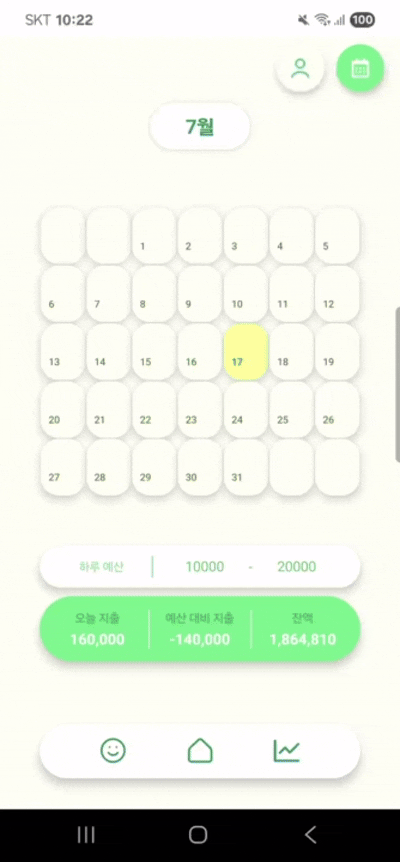

# Gamja-boo

### 서비스 소개

**감자부**는 사용자가 한 달 동안 절약한 금액을 포인트로 환산해 제공하고, 이 포인트로 게임 내 아이템을 구매하여 캐릭터를 꾸밀 수 있는 게임형 가계부 앱입니다.  
반복적인 기록만으로 금방 지치는 기존 가계부 방식에서 벗어나, 절약이 곧 캐릭터 성장으로 이어지는 구조를 통해 사용자의 지속적인 가계부 사용을 자연스럽게 유도합니다.

> 메인 캐릭터 - 감도리

### 주요 서비스 화면

#### 1. 로그인

#### 2. 메인 페이지

#### 3. 수입/지출 기입

> 기입 전

> 기입 후

#### 4. 통계

#### 5. 상점

> 아이템 구매 전

> 아이템 구매 후

#### 6. 마이페이지

